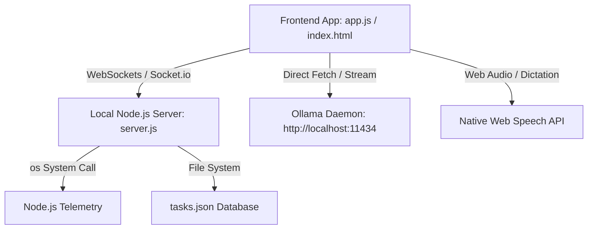

# xi-io: ibal Console

A professional-grade, Teenage Engineering inspired dual-pane orchestration console and interactive paired-device interface built for `xi-io.net` workspace coordination. 

This console operates entirely locally, utilizing a self-signed HTTPS secure connection to access browser APIs (such as Speech Recognition and Camera video capture) and communicates with local LLM runtimes (via Ollama) to coordinate project tasks.

---

## 🛠 Features

1. **Interactive Paired-Device Interface (Rabbit R1 Surface)**:
   - High-fidelity visual replication of the original pocket device chassis.
   - Fully bindable physical PTT button, active scroll wheel, and rotational camera module.
   - Standard keyboard mapping: `ArrowUp`/`AudioVolumeUp` (scroll wheel up), `ArrowDown`/`AudioVolumeDown` (scroll wheel down), `Enter`/`Space`/`Select` (wheel click/PTT).

2. **Desktop Productivity Control Panel**:
   - **System Telemetry**: Real-time Node.js backend monitoring showing CPU usage, RAM utilization, system uptime, and active AI model state.
   - **Interactive Kanban Board**: HTML5 Drag & Drop board linked directly to the R1 pocket UI's internal task runner. Updates are synchronized dynamically using WebSocket pushes and persisted to a local JSON database.
   - **Model Manager**: Direct client-side pulling of models from the Ollama library with active progress bar feedback, and real-time model switching.
   - **Interactive Console Log**: Color-coded, scrollable diagnostic terminal output highlighting system events, socket connection changes, and AI query steps.

3. **Local AI & Speech Orchestration**:
   - Integration with Ollama APIs (`/api/tags`, `/api/pull`, `/api/chat`) for offline reasoning.
   - Web Speech API for voice dictation (when holding the PTT button) and text-to-speech feedback.

---

## ⚙️ Architecture

The app is architected as a lightweight, secure hybrid interface:



- **Backend**: Express + HTTPS + Socket.io + Native Node modules (`os`, `fs`, `https`).
- **Frontend**: Vanilla CSS Grid/Flexbox + Vanilla JS client. Responsive fallback collapses to pocket-only view when screen width is < 800px.

---

## 🚀 Getting Started

### Prerequisites

- Node.js installed on your Pop!_OS workstation.
- Ollama running locally at `http://localhost:11434`.

### 1. Generate SSL Certificates (Required for Voice & Camera APIs)

Since modern browsers block access to Speech Recognition and Camera feeds on unencrypted HTTP connections, the local server runs over HTTPS using self-signed certificates.

Run the following command in this directory to generate `key.pem` and `cert.pem`:

```bash
openssl req -nodes -new -x509 -keyout key.pem -out cert.pem -days 365 -subj "/CN=localhost"
```

### 2. Install Dependencies

Install the required npm packages:

```bash
npm install
```

### 3. Run the Server

Start the local companion application:

```bash
npm start
```

Open your browser and navigate to **`https://localhost:3000`**. You may need to bypass the self-signed certificate warning (click "Advanced" -> "Proceed to localhost (unsafe)").

---

## 🎮 Interface Controls

### R1 Chassis Interaction
- **Scroll Wheel**: Use mouse click/drag on the wheel or hover and use the scroll buttons to cycle through dashboard apps.
- **PTT Button**: Click and hold the Left/Right side chassis button to activate voice dictation. Release to send the query.
- **Camera Eye**: Click to rotate the lens 180 degrees. Toggles the live viewport feedback for vision analysis tasks.

### Keyboard Bindings
- **ArrowUp / VolumeUp**: Move selection focus up.
- **ArrowDown / VolumeDown**: Move selection focus down.
- **Enter / Space**: Select or confirm action / trigger PTT.
- *Note: Controls automatically bypass interception when cursor focus is inside standard text input fields.*
