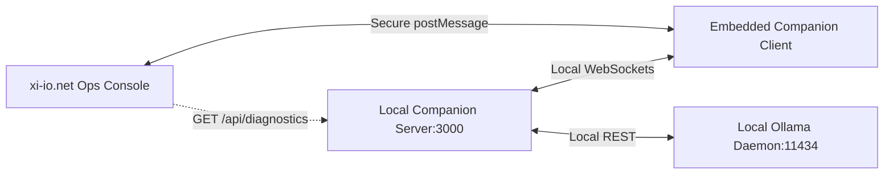

# Milestone Spec: R1 Companion Integration (XIO-R1-COMPANION-INTEGRATION-002)

## 1. Overview
The goal of this milestone is to integrate the local `xi_io_rabbit_mod` (Rabbit R1 Companion) into the centralized `xi-io.net` operations framework. This enables two-way synchronization of system telemetry, task status records, and AI model configurations between the developer's local workstation companion and the static-first operations dashboard console.

---

## 2. Integration Architecture
Because the `xi-io.net` console is a static-first web app served over HTTPS, and the Rabbit R1 Companion runs locally on `https://localhost:3000`, the connection will be established via two concurrent methods:
1. **Client-Side Iframe Bridge**: The ops console embeds the local companion as a sandboxed helper using secure `postMessage` communication.
2. **Local HTTP/JSON API Poll**: The console checks client-side network accessibility to fetch diagnostic status directly.



---

## 3. Communication Protocols

### A. Direct HTTP Health Check
The ops console monitors accessibility using `check-status.sh` or local fetch requests:
* **Endpoint**: `GET https://localhost:3000/api/health`
* **Response Format**:
```json
{
  "status": "HEALTHY",
  "uptime": 12854.2,
  "telemetry": {
    "cpuUsage": 12.4,
    "memUsage": 62.1,
    "activeModel": "llama3:latest"
  },
  "diagnostics": {
    "camera": "connected",
    "microphone": "connected"
  }
}
```

### B. Cross-Origin `postMessage` Events
To synchronize the Kanban board state with framework status manifests:
* **Event (Companion to Ops Console)**: `XIO_R1_SYNC_TASKS`
```json
{
  "type": "XIO_R1_SYNC_TASKS",
  "origin": "https://localhost:3000",
  "payload": {
    "timestamp": "2026-06-03T22:00:00Z",
    "tasks": [
      { "id": "task-001", "title": "Refactor speech engine", "status": "doing" },
      { "id": "task-002", "title": "Deploy verification scripts", "status": "done" }
    ]
  }
}
```

---

## 4. UI Alignment
The integrated dashboard will host a dual-view split panel:
1. **Workspace Control Grid (Left)**: Renders standard `xi-io.net` framework telemetry and registry lists.
2. **Active Workstation Cockpit (Right)**: Shows the live-status indicators and interactive viewport of the Rabbit Companion, facilitating zero-context-switching project updates.

---

## 5. Security & Isolation Controls
* **CORS Settings**: The local companion server will restrict CORS headers strictly to `https://*.xi-io.net` and `https://xi-io.net`.
* **Credential Isolation**: No OAuth tokens or private key credentials will be passed between the environments.
* **Sandbox Attributes**: The embedded companion iframe will use restrictive sandboxing: `sandbox="allow-scripts allow-forms allow-same-origin allow-popups"`.
